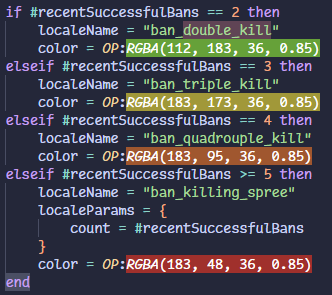
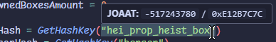
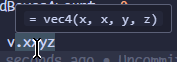

# VS FiveM IntelliSense

This extension adds FiveM native support, code-completions, diagnostics and helpful commands for lua files. If you like the extension or find it useful, please consider giving it a star on [GitHub](https://github.com/coalaura/vs-fivem) or leaving a [review on the VS Code Marketplace](https://marketplace.visualstudio.com/items?itemName=coalaura.vs-fivem&ssr=false#review-details)!

I recommend also getting [sumneko's lua language server](https://marketplace.visualstudio.com/items?itemName=sumneko.lua) for reference finding, lua auto-completion and more helpful features. To not interfere with this extension i'd also turn off `Lua.diagnostics.enable`, `Lua.semantic.variable` and increasing `Lua.workspace.preloadFileSize` if necessary.

### Detailed native documentation
Natives are automatically updated from the FiveM documentation.

### Built in search

### Auto-completion
The extension will try to detect the context of the current file (server or client) and will prioritize natives that are available in that context.

### Inline Hints

### Color highlighting
The extension will automatically try to detect any color values and highlight them.

### Hover support
The extension will show a preview of a hash function when hovering over it. With lua-glm enabled it also provides hover suggestions for vector swizzling.

### Diagnostics & Bad-Practice warnings

### Helpful snippets

### Easy and quick resource generation

### Quickly find all issues in a directory and fix them with 2 clicks

