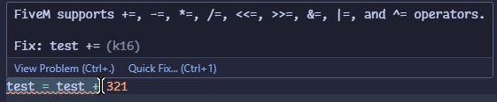
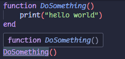

# VS FiveM IntelliSense

This extension adds FiveM native support, code-completions, diagnostics and helpful commands for lua files.

### Support for most of FiveM's [lua-glm](https://github.com/citizenfx/lua/blob/luaglm-dev/cfx/README.md) extensions
```lua
-- Support +=, -=, *=, /=, <<=, >>=, &=, |=, and ^= operators
test += 123

-- Same as: local a, b, c = t.a, t.b, t.c
local a, b, c in t

-- Safe Navigation
local a = t?.a?.b?.c

-- GLSL style vector swizzling
local a = t.xyz
```



### Detailed native documentation
Natives are automatically updated from the FiveM documentation.


### Definition provider
You can jump to the definition of any function you defined in your code by holding CTRL and clicking on the function name.



### Built in search


### Auto-completion & Formatter
The extension will try to detect the context of the current file (server or client) and will prioritize natives that are available in that context.

The native also provides a lua formatter, that is integrated with the other vscode formatters.


### Diagnostics & Bad-Practice warnings


### Helpful snippets


### Easy and quick resource generation


### Quickly find all issues in a directory and fix them with 2 clicks


### Statistics
Displays statistics related to the current file in the status bar.


