# vs-fivem

This extension adds FiveM native support, code-completions, diagnostics and helpful commands for lua files.

### Detailed native documentation
Natives are automatically updated from the FiveM documentation.

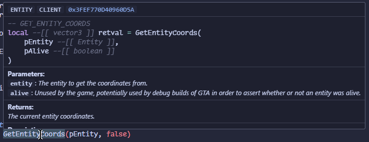

### Built in search

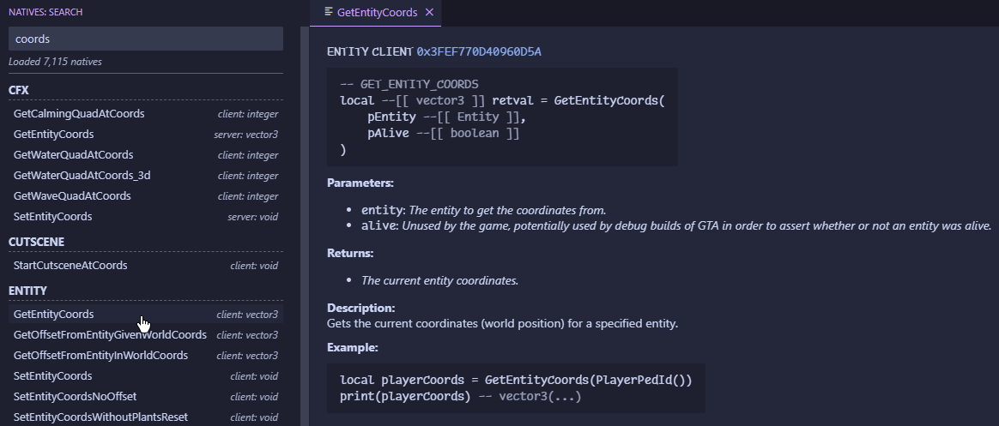

### Auto-completion & Formatter
The extension will try to detect the context of the current file (server or client) and will prioritize natives that are available in that context.

The native also provides a lua formatter, that is integrated with the other vscode formatters.

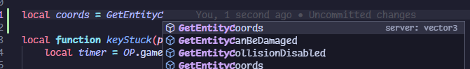

### Diagnostics & Bad-Practice warnings

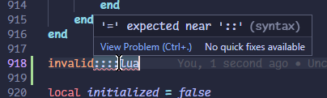

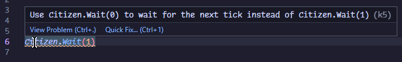

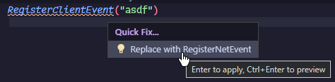

### Helpful snippets

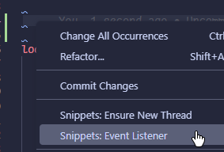

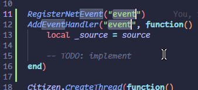

### Easy and quick resource generation

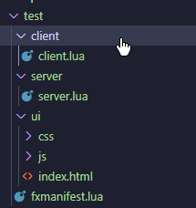

### Quickly find all issues in a directory and fix them with 2 clicks

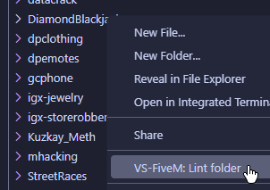

### Statistics
Displays statistics related to the current file in the status bar.

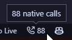
