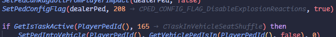

# VS FiveM IntelliSense

This extension adds FiveM native support, code-completions, diagnostics and helpful commands for lua files.

I recommend also getting [sumneko's lua language server](https://marketplace.visualstudio.com/items?itemName=sumneko.lua) for reference finding, lua auto-completion and more helpful features. To not interfere with this extension i'd also turn off `Lua.diagnostics.enable`, `Lua.semantic.variable` and increasing `Lua.workspace.preloadFileSize` if necessary.

### Support for most of FiveM's [lua-glm](https://github.com/citizenfx/lua/blob/luaglm-dev/cfx/README.md) extensions
```lua
-- Support +=, -=, *=, /=, <<=, >>=, &=, |=, and ^= operators
test += 123

-- Same as: local a, b, c = t.a, t.b, t.c
local a, b, c in t

-- Safe Navigation
local a = t?.a?.b?.c

-- GLSL style vector swizzling
local a = t.xyz

-- C-Style Comments
/* This is a comment */

-- Compile Time Jenkins' Hashes
`Hello, World!` -- 1395890823
```


### Detailed native documentation
Natives are automatically updated from the FiveM documentation.


### Built in search


### Auto-completion
The extension will try to detect the context of the current file (server or client) and will prioritize natives that are available in that context.


### Inline Hints



### Color highlighting
The extension will automatically try to detect any color values and highlight them.


### Hover support
The extension will show a preview of a hash function when hovering over it. With lua-glm enabled it also provides hover suggestions for vector swizzling.


### Diagnostics & Bad-Practice warnings


### Helpful snippets


### Easy and quick resource generation


### Quickly find all issues in a directory and fix them with 2 clicks


